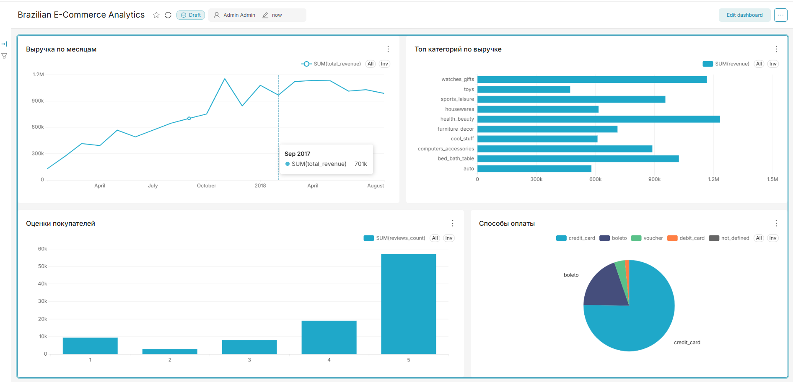

# Brazilian E-Commerce Dashboard

Аналитический дашборд на основе реальных данных бразильского маркетплейса Olist (100k+ заказов).

## Стек
- **PostgreSQL** — хранение данных
- **Python** (pandas, sqlalchemy) — загрузка и EDA
- **SQL** — аналитические запросы
- **Apache Superset** — визуализация и дашборд

## Структура проекта
```
ecommerce-dashboard/
├── sql/
│   ├── 01_create_schema.sql      # Схема БД (8 таблиц)
│   └── 04_dashboard_queries.sql  # SQL-запросы для дашборда
├── notebooks/
│   └── 03_eda.ipynb              # Разведочный анализ данных
├── scripts/
│   └── 02_load_data.py           # Загрузка CSV в PostgreSQL
└── README.md
```

## Данные
Датасет: [Brazilian E-Commerce (Olist)](https://www.kaggle.com/datasets/olistbr/brazilian-ecommerce)
- 99 441 заказов за 2016–2018 гг.
- 8 связанных таблиц: заказы, товары, покупатели, продавцы, отзывы, платежи

## Как запустить

### 1. Создать схему БД
```sql
-- Запустить в pgAdmin (база ecommerce)
-- файл sql/01_create_schema.sql
```

### 2. Загрузить данные
```bash
pip install psycopg2-binary sqlalchemy pandas
python scripts/02_load_data.py
```

### 3. Запустить Superset
```bash
docker run -d -p 8088:8088 --name superset \
  -e "SUPERSET_SECRET_KEY=myStrongSecretKey123!" \
  apache/superset

docker exec -u root -it superset bash -c \
  "cp -r /app/superset_home/.local/lib/python3.10/site-packages/psycopg2* \
  /app/.venv/lib/python3.10/site-packages/"

docker exec -it superset superset fab create-admin \
  --username admin --firstname Admin --lastname Admin \
  --email admin@example.com --password admin123

docker exec -it superset superset db upgrade
docker exec -it superset superset init
```

Открыть: http://localhost:8088 (admin / admin123)

## Ключевые инсайты

- **Топ категория**: health_beauty (~1.2M BRL выручки)
- **Рост**: выручка выросла в ~8 раз с начала 2017 по конец 2017
- **Оценки**: 57% покупателей ставят оценку 5/5
- **Оплата**: 74% заказов оплачивается кредитной картой
- **Доставка**: среднее время доставки ~12 дней

## Дашборд

